# zerobyte.css
CSS Library for creating minimalistic dark websites

## Carbon Colors
```html
<!DOCTYPE html>
<html lang="en" class="carbon_colors">
<head>
	<meta charset="UTF-8">
	<meta name="viewport" content="width=device-width, initial-scale=1.0">
	<title>zerobyte.css</title>
	<link rel="preconnect" href="https://fonts.googleapis.com">
	<link rel="preconnect" href="https://fonts.gstatic.com" crossorigin>
	<link href="https://fonts.googleapis.com/css2?family=IBM+Plex+Mono:ital,wght@0,100;0,200;0,300;0,400;0,500;0,600;0,700;1,100;1,200;1,300;1,400;1,500;1,600;1,700&family=JetBrains+Mono:ital,wght@0,100..800;1,100..800&family=Old+Standard+TT:ital,wght@0,400;0,700;1,400&family=Oranienbaum&family=PT+Mono&family=PT+Serif:ital,wght@0,400;0,700;1,400;1,700&display=swap" rel="stylesheet">
	<!-- <link href="https://fonts.googleapis.com/css2?family=Anonymous+Pro:ital,wght@0,400;0,700;1,400;1,700&family=Fira+Code:wght@300..700&family=Ubuntu+Sans+Mono:ital,wght@0,400..700;1,400..700&display=swap" rel="stylesheet"> -->
	<link href="https://fonts.googleapis.com/css2?family=Forum&family=Roboto+Serif:ital,opsz,wght@0,8..144,100..900;1,8..144,100..900&display=swap" rel="stylesheet">
	<link href="https://fonts.googleapis.com/css2?family=Roboto+Slab:wght@100..900&display=swap" rel="stylesheet">

	<link rel="stylesheet" href="css/normalize.css">
	<link rel="stylesheet" href="css/root.css">
	<link rel="stylesheet" href="css/header.css">
	<link rel="stylesheet" href="css/content.css">
	<link rel="stylesheet" href="css/footer.css">
	<link rel="stylesheet" href="css/gruvbox.css">
	<script src="js/highlight.min.js"></script>
</head>
<body>
	<div class="progress" id="scrollIndicator"></div>

	<header id="header" class="header">
		<a href="#"><h1>zerobyte.css</h1></a>

		<nav class="headermenu">
			<a href="#about">About</a>
			<a href="#install">Install</a>
			<a href="#docs">Docs</a>
			<a href="#examples">Examples</a>
		</nav>

		<button class="burger__btn">
			<span></span><span></span><span></span>
		</button>
	</header>
		
	
	<div class="container">
		<div class="introduction">
			<h1 class="title">zerobyte.css</h1>
			<h1 class="subtitle">Dark CSS Library</h1>
			<h1 class="subtitle">for Coders</h1>
			<p class="bottom-text">created by <a href="https://github.com/alexeev-prog">alexeev-prog</a></p>
		</div>

		<div class="sidebar">
			<h3>Main</h3>
			<ul>
				<li class="active"><a href="#" class="active"><h4>Home</h4></a></li>
				<li><a href="#about"><h4>About</h4></a></li>
				<li><a href="#install"><h4>Install</h4></a></li>
				<li><a href="#docs"><h4>Docs</h4></a></li>
				<li><a href="#examples"><h4>Examples</h4></a></li>
			</ul>
		</div>

		<div class="content">
			<div class="contents">
				<h3>Contents</h3>
				<ul>
					<li><a href="#">Home</a></li>
					<li><a href="#about">About</a></li>
					<li><a href="#install">Install</a></li>
					<li><a href="#docs">Docs</a></li>
					<li><a href="#examples">Examples</a></li>
				</ul>
			</div>
			<div id="about">
				<h2 class="section-title">About</h2>
				<p>zerobyte.css is a universal minimalistic fast CSS library for creating minimalistic site for coders (ex. for documentation).</p>
				<p>This library use brighted, high-contrast, smooth, pastel colors and dark theme with combo of mono&serif fonts.</p>
			</div>
			<div id="install">
				<h2 class="section-title">Install</h2>
				<p>Lorem ipsum dolor sit amet consectetur adipisicing elit. Ducimus deserunt aliquid nulla inventore, obcaecati saepe, ipsum quaerat praesentium tempore deleniti excepturi velit optio ut magni quibusdam corporis minima quidem hic!</p>
				<p>Lorem ipsum dolor sit amet consectetur adipisicing elit. Laborum, amet! Numquam ipsam ex, non sequi perspiciatis quos temporibus sapiente voluptatem nihil pariatur animi, eaque aliquam rerum quaerat odit voluptates nisi?
				Quod incidunt, distinctio debitis nesciunt possimus cumque nihil. Culpa, incidunt eaque ea nobis quasi assumenda dicta. Nemo sapiente dignissimos, voluptatum optio quia provident sed odit officiis illo, esse ullam laboriosam.
				Totam dignissimos debitis deserunt vel in optio voluptates, omnis unde distinctio sunt asperiores nulla commodi consequuntur sequi laudantium. Rerum, nostrum! Natus, cumque vel quibusdam fuga aperiam nihil nostrum? Laboriosam, nesciunt?</p>
			</div>
			<div id="docs">
				<h2 class="section-title">Docs</h2>
				<p>Lorem ipsum dolor sit amet consectetur adipisicing elit. Nostrum corrupti soluta sunt facilis natus eligendi odit numquam fugit. Amet consequuntur consectetur omnis nam molestiae, accusantium dolor esse inventore reprehenderit possimus id non eligendi ullam sequi fugit perspiciatis voluptatem vero quaerat autem, exercitationem ducimus ratione voluptatibus veniam officiis? Facere debitis natus, et assumenda asperiores unde illum quae rem deserunt beatae accusantium sunt hic delectus, exercitationem illo placeat nisi voluptatem eaque voluptatum veniam consequatur ut. Perferendis est, vero magnam ex rem corrupti!</p>
			</div>
			<div id="examples">
				<h2 class="section-title">Examples</h2>

				<h3>Code syntax highlight</h3>
				<p>zerobyte.css use highlight.js library with gruvbox dark theme for syntax highlight</p>
				<pre><code class="language-armasm">
;;;;;;;;;;;;;;;;;;;;;;;;;;;;;;;;;;;;;;;;;;;;;;;;;;;;;;;;;;;;;;;;;;;;;;;;;;;;;;;;;;;;;;;;;;;;;;;;;;;;;;;;;;;;;;;;;;;;;;;;
;; Author: alexeev-prog                                                                                               ;;
;; Example ASM Program                                                                                                ;;
;; Program generated by FLEXPASM (github.com/alexeev-pro/flexpasm)                                                    ;;
;;;;;;;;;;;;;;;;;;;;;;;;;;;;;;;;;;;;;;;;;;;;;;;;;;;;;;;;;;;;;;;;;;;;;;;;;;;;;;;;;;;;;;;;;;;;;;;;;;;;;;;;;;;;;;;;;;;;;;;;

format ELF64 executable;                        ; ELF64 EXECUTABLE
entry start                                     ; Set Start Entry


;; Segment readable executable in FASM is a directive for defining a section of code with readable and executable attributes.
segment readable executable

start:                                          ; Label start with 8 commands
	MOV RAX, 4                                      ; Loading 4 value into RAX register.
	MOV RCX, message                                ; Loading message value into RCX register.
	MOV RDX, message_size                           ; Loading message_size value into RDX register.
	INT 0x80                                        ; Call software interrupt 0x80: SYSCALL
	MOV RAX, 1                                      ; Loading 1 value into RAX register.
	XOR RBX, RBX                                    ; Exclusive OR operation RBX and RBX using XOR
	INT 0x80                                        ; Call software interrupt 0x80: SYSCALL
	JMP exit                                        ; Unconditional jump to label exit

exit:                                           ; Label exit with 3 commands
	; Exit with code -1
	MOV RAX, 1                                      ; Loading 1 value into RAX register.
	MOV RBX, -1                                     ; Loading -1 value into RBX register.
	INT 0x80                                        ; Call software interrupt 0x80: SYSCALL


;; Segment readable writeable in FASM is a definition of a segment of program data codes, where the attributes readable (the contents of the segment can be read) and writeable (program commands can both read codes and change their values) are specified for it.
segment readable writeable

message db 'Hello, World!', 0                   ; Var message (string)
message_size = $-message                        ; Var message (string) length
				</code></pre>
				<pre><code class="language-python">
import socket

from typing import Dict


PORTS_SERVICES = {
    20: "FTP-DATA", 21: "FTP", 22: "SSH", 23: "Telnet",
    25: "SMTP", 43: "WHOIS", 53: "DNS", 80: "http",
    115: "SFTP", 123: "NTP", 143: "IMAP", 161: "SNMP",
    179: "BGP", 443: "HTTPS", 445: "MICROSOFT-DS",
    514: "SYSLOG", 515: "PRINTER", 993: "IMAPS",
    995: "POP3S", 1080: "SOCKS", 1194: "OpenVPN",
    1433: "SQL Server", 1723: "PPTP", 3128: "HTTP",
    3268: "LDAP", 3306: "MySQL", 3389: "RDP",
    5432: "PostgreSQL", 5900: "VNC", 8080: "Tomcat", 10000: "Webmin"
}


def is_open_port(target: str, port: int):
    s = socket.socket(socket.AF_INET, socket.SOCK_STREAM)
    s.settimeout(0.5)

    try:
        s.connect((target, port))
        s.close()
    except (socket.gaierror, TimeoutError):
        return port, {
            'status': "Закрыт",
            'comment': PORTS_SERVICES.get(port, 'Неизвестный порт')
        }
    else:
        return port, {
            'status': "Открыт",
            'comment': PORTS_SERVICES.get(port, 'Неизвестный порт')
        }
				</code></pre>
			</div>
		</div>

		<footer>
			<p>powered by <a href="https://github.com/alexeev-prog/zerobyte.css">zerobyte.css</a></p>
		</footer>
	</div>

	<script>hljs.highlightAll();</script>
	<script src="js/script.js"></script>

</body>
</html>
```

### Screenshots

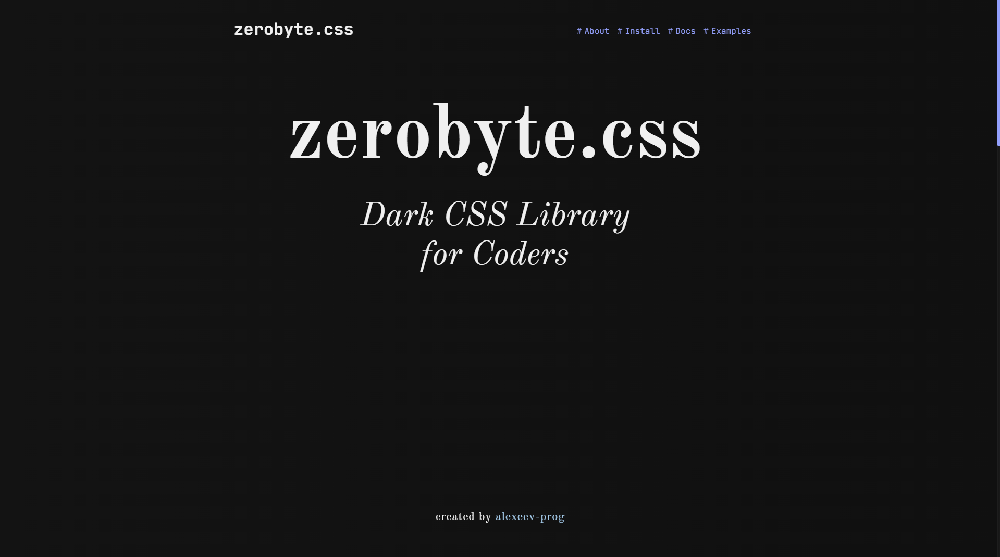

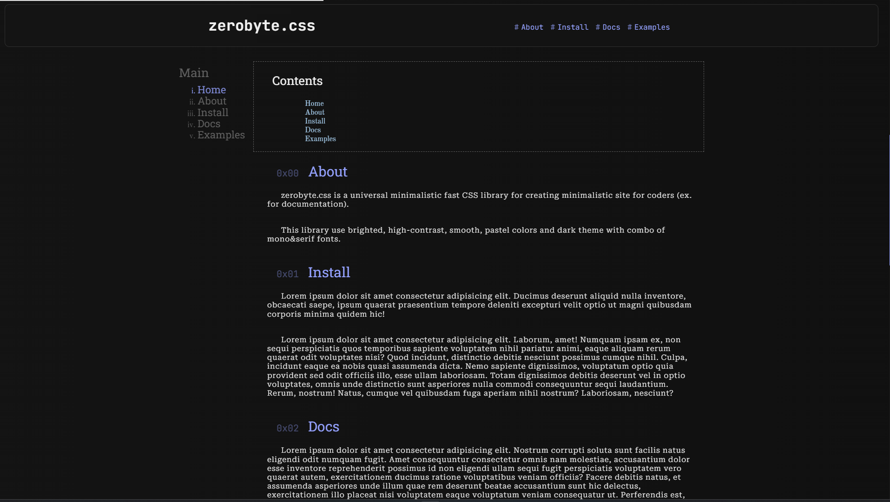

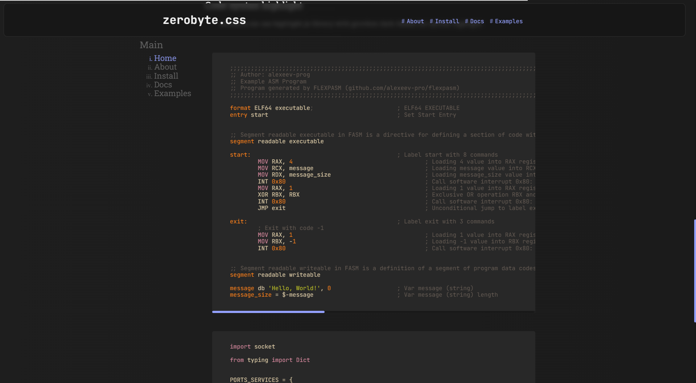

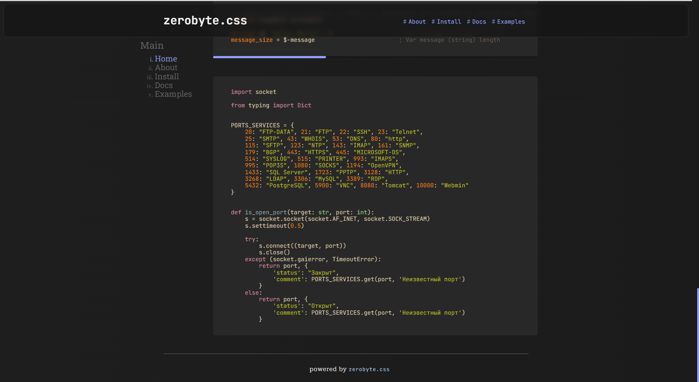

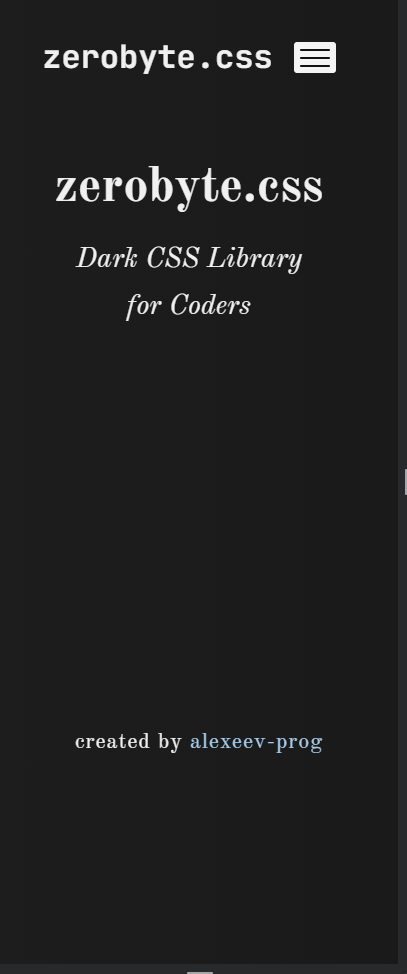

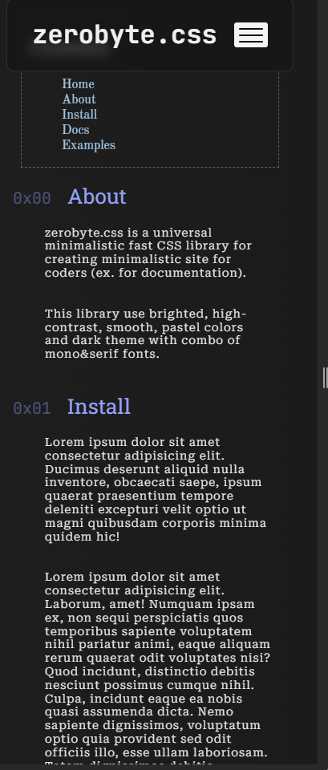

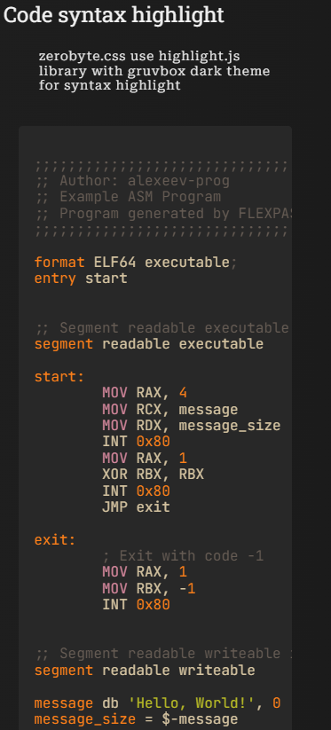

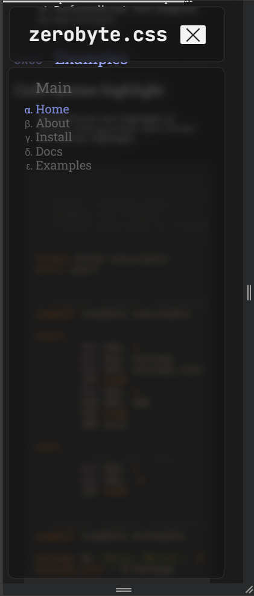

## Gruvbox Colors
```html
<!DOCTYPE html>
<html lang="en" class="gruvbox_colors">
<head>
	<meta charset="UTF-8">
	<meta name="viewport" content="width=device-width, initial-scale=1.0">
	<title>zerobyte.css</title>
	<link rel="preconnect" href="https://fonts.googleapis.com">
	<link rel="preconnect" href="https://fonts.gstatic.com" crossorigin>
	<link href="https://fonts.googleapis.com/css2?family=IBM+Plex+Mono:ital,wght@0,100;0,200;0,300;0,400;0,500;0,600;0,700;1,100;1,200;1,300;1,400;1,500;1,600;1,700&family=JetBrains+Mono:ital,wght@0,100..800;1,100..800&family=Old+Standard+TT:ital,wght@0,400;0,700;1,400&family=Oranienbaum&family=PT+Mono&family=PT+Serif:ital,wght@0,400;0,700;1,400;1,700&display=swap" rel="stylesheet">
	<!-- <link href="https://fonts.googleapis.com/css2?family=Anonymous+Pro:ital,wght@0,400;0,700;1,400;1,700&family=Fira+Code:wght@300..700&family=Ubuntu+Sans+Mono:ital,wght@0,400..700;1,400..700&display=swap" rel="stylesheet"> -->
	<link href="https://fonts.googleapis.com/css2?family=Forum&family=Roboto+Serif:ital,opsz,wght@0,8..144,100..900;1,8..144,100..900&display=swap" rel="stylesheet">
	<link href="https://fonts.googleapis.com/css2?family=Roboto+Slab:wght@100..900&display=swap" rel="stylesheet">

	<link rel="stylesheet" href="css/normalize.css">
	<link rel="stylesheet" href="css/root.css">
	<link rel="stylesheet" href="css/header.css">
	<link rel="stylesheet" href="css/content.css">
	<link rel="stylesheet" href="css/footer.css">
	<link rel="stylesheet" href="css/gruvbox.css">
	<script src="js/highlight.min.js"></script>
</head>
<body>
	<div class="progress" id="scrollIndicator"></div>

	<header id="header" class="header">
		<a href="#"><h1>zerobyte.css</h1></a>

		<nav class="headermenu">
			<a href="#about">About</a>
			<a href="#install">Install</a>
			<a href="#docs">Docs</a>
			<a href="#examples">Examples</a>
		</nav>

		<button class="burger__btn">
			<span></span><span></span><span></span>
		</button>
	</header>
		
	
	<div class="container">
		<div class="introduction">
			<h1 class="title">zerobyte.css</h1>
			<h1 class="subtitle">Dark CSS Library</h1>
			<h1 class="subtitle">for Coders</h1>
			<p class="bottom-text">created by <a href="https://github.com/alexeev-prog">alexeev-prog</a></p>
		</div>

		<div class="sidebar">
			<h3>Main</h3>
			<ul>
				<li class="active"><a href="#" class="active"><h4>Home</h4></a></li>
				<li><a href="#about"><h4>About</h4></a></li>
				<li><a href="#install"><h4>Install</h4></a></li>
				<li><a href="#docs"><h4>Docs</h4></a></li>
				<li><a href="#examples"><h4>Examples</h4></a></li>
			</ul>
		</div>

		<div class="content">
			<div class="contents">
				<h3>Contents</h3>
				<ul>
					<li><a href="#">Home</a></li>
					<li><a href="#about">About</a></li>
					<li><a href="#install">Install</a></li>
					<li><a href="#docs">Docs</a></li>
					<li><a href="#examples">Examples</a></li>
				</ul>
			</div>
			<div id="about">
				<h2 class="section-title">About</h2>
				<p>zerobyte.css is a universal minimalistic fast CSS library for creating minimalistic site for coders (ex. for documentation).</p>
				<p>This library use brighted, high-contrast, smooth, pastel colors and dark theme with combo of mono&serif fonts.</p>
			</div>
			<div id="install">
				<h2 class="section-title">Install</h2>
				<p>Lorem ipsum dolor sit amet consectetur adipisicing elit. Ducimus deserunt aliquid nulla inventore, obcaecati saepe, ipsum quaerat praesentium tempore deleniti excepturi velit optio ut magni quibusdam corporis minima quidem hic!</p>
				<p>Lorem ipsum dolor sit amet consectetur adipisicing elit. Laborum, amet! Numquam ipsam ex, non sequi perspiciatis quos temporibus sapiente voluptatem nihil pariatur animi, eaque aliquam rerum quaerat odit voluptates nisi?
				Quod incidunt, distinctio debitis nesciunt possimus cumque nihil. Culpa, incidunt eaque ea nobis quasi assumenda dicta. Nemo sapiente dignissimos, voluptatum optio quia provident sed odit officiis illo, esse ullam laboriosam.
				Totam dignissimos debitis deserunt vel in optio voluptates, omnis unde distinctio sunt asperiores nulla commodi consequuntur sequi laudantium. Rerum, nostrum! Natus, cumque vel quibusdam fuga aperiam nihil nostrum? Laboriosam, nesciunt?</p>
			</div>
			<div id="docs">
				<h2 class="section-title">Docs</h2>
				<p>Lorem ipsum dolor sit amet consectetur adipisicing elit. Nostrum corrupti soluta sunt facilis natus eligendi odit numquam fugit. Amet consequuntur consectetur omnis nam molestiae, accusantium dolor esse inventore reprehenderit possimus id non eligendi ullam sequi fugit perspiciatis voluptatem vero quaerat autem, exercitationem ducimus ratione voluptatibus veniam officiis? Facere debitis natus, et assumenda asperiores unde illum quae rem deserunt beatae accusantium sunt hic delectus, exercitationem illo placeat nisi voluptatem eaque voluptatum veniam consequatur ut. Perferendis est, vero magnam ex rem corrupti!</p>
			</div>
			<div id="examples">
				<h2 class="section-title">Examples</h2>

				<h3>Code syntax highlight</h3>
				<p>zerobyte.css use highlight.js library with gruvbox dark theme for syntax highlight</p>
				<pre><code class="language-armasm">
;;;;;;;;;;;;;;;;;;;;;;;;;;;;;;;;;;;;;;;;;;;;;;;;;;;;;;;;;;;;;;;;;;;;;;;;;;;;;;;;;;;;;;;;;;;;;;;;;;;;;;;;;;;;;;;;;;;;;;;;
;; Author: alexeev-prog                                                                                               ;;
;; Example ASM Program                                                                                                ;;
;; Program generated by FLEXPASM (github.com/alexeev-pro/flexpasm)                                                    ;;
;;;;;;;;;;;;;;;;;;;;;;;;;;;;;;;;;;;;;;;;;;;;;;;;;;;;;;;;;;;;;;;;;;;;;;;;;;;;;;;;;;;;;;;;;;;;;;;;;;;;;;;;;;;;;;;;;;;;;;;;

format ELF64 executable;                        ; ELF64 EXECUTABLE
entry start                                     ; Set Start Entry


;; Segment readable executable in FASM is a directive for defining a section of code with readable and executable attributes.
segment readable executable

start:                                          ; Label start with 8 commands
	MOV RAX, 4                                      ; Loading 4 value into RAX register.
	MOV RCX, message                                ; Loading message value into RCX register.
	MOV RDX, message_size                           ; Loading message_size value into RDX register.
	INT 0x80                                        ; Call software interrupt 0x80: SYSCALL
	MOV RAX, 1                                      ; Loading 1 value into RAX register.
	XOR RBX, RBX                                    ; Exclusive OR operation RBX and RBX using XOR
	INT 0x80                                        ; Call software interrupt 0x80: SYSCALL
	JMP exit                                        ; Unconditional jump to label exit

exit:                                           ; Label exit with 3 commands
	; Exit with code -1
	MOV RAX, 1                                      ; Loading 1 value into RAX register.
	MOV RBX, -1                                     ; Loading -1 value into RBX register.
	INT 0x80                                        ; Call software interrupt 0x80: SYSCALL


;; Segment readable writeable in FASM is a definition of a segment of program data codes, where the attributes readable (the contents of the segment can be read) and writeable (program commands can both read codes and change their values) are specified for it.
segment readable writeable

message db 'Hello, World!', 0                   ; Var message (string)
message_size = $-message                        ; Var message (string) length
				</code></pre>
				<pre><code class="language-python">
import socket

from typing import Dict


PORTS_SERVICES = {
    20: "FTP-DATA", 21: "FTP", 22: "SSH", 23: "Telnet",
    25: "SMTP", 43: "WHOIS", 53: "DNS", 80: "http",
    115: "SFTP", 123: "NTP", 143: "IMAP", 161: "SNMP",
    179: "BGP", 443: "HTTPS", 445: "MICROSOFT-DS",
    514: "SYSLOG", 515: "PRINTER", 993: "IMAPS",
    995: "POP3S", 1080: "SOCKS", 1194: "OpenVPN",
    1433: "SQL Server", 1723: "PPTP", 3128: "HTTP",
    3268: "LDAP", 3306: "MySQL", 3389: "RDP",
    5432: "PostgreSQL", 5900: "VNC", 8080: "Tomcat", 10000: "Webmin"
}


def is_open_port(target: str, port: int):
    s = socket.socket(socket.AF_INET, socket.SOCK_STREAM)
    s.settimeout(0.5)

    try:
        s.connect((target, port))
        s.close()
    except (socket.gaierror, TimeoutError):
        return port, {
            'status': "Закрыт",
            'comment': PORTS_SERVICES.get(port, 'Неизвестный порт')
        }
    else:
        return port, {
            'status': "Открыт",
            'comment': PORTS_SERVICES.get(port, 'Неизвестный порт')
        }
				</code></pre>
			</div>
		</div>

		<footer>
			<p>powered by <a href="https://github.com/alexeev-prog/zerobyte.css">zerobyte.css</a></p>
		</footer>
	</div>

	<script>hljs.highlightAll();</script>
	<script src="js/script.js"></script>

</body>
</html>
```

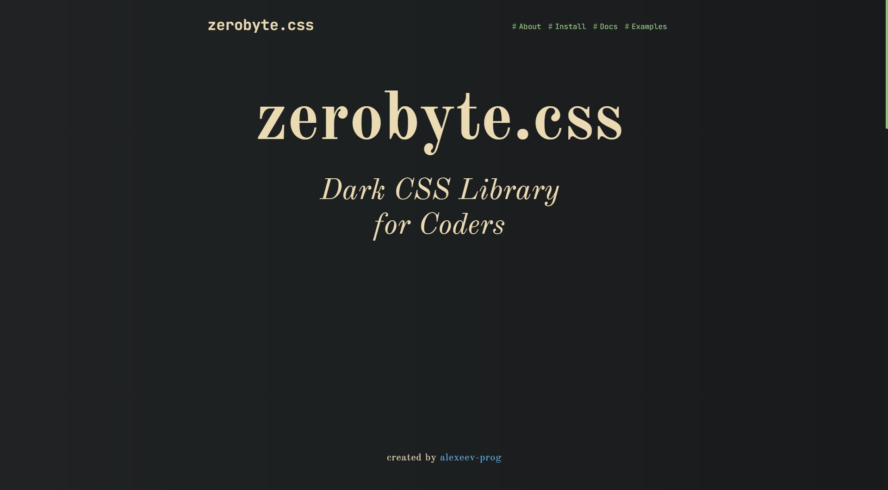

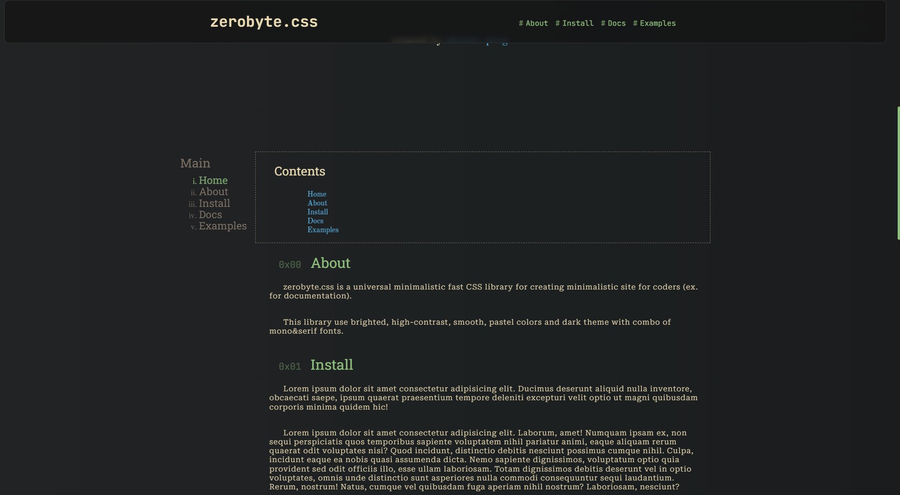

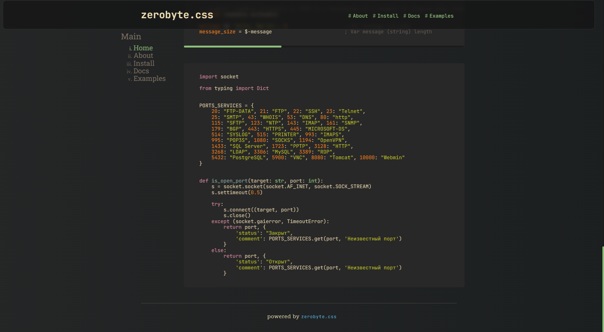

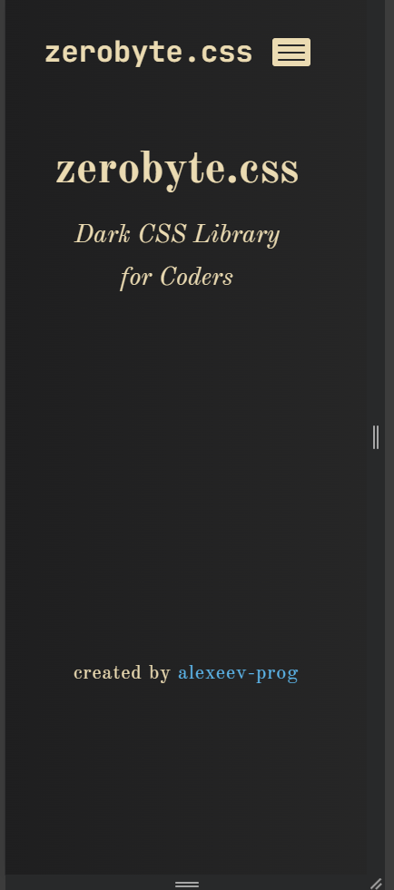

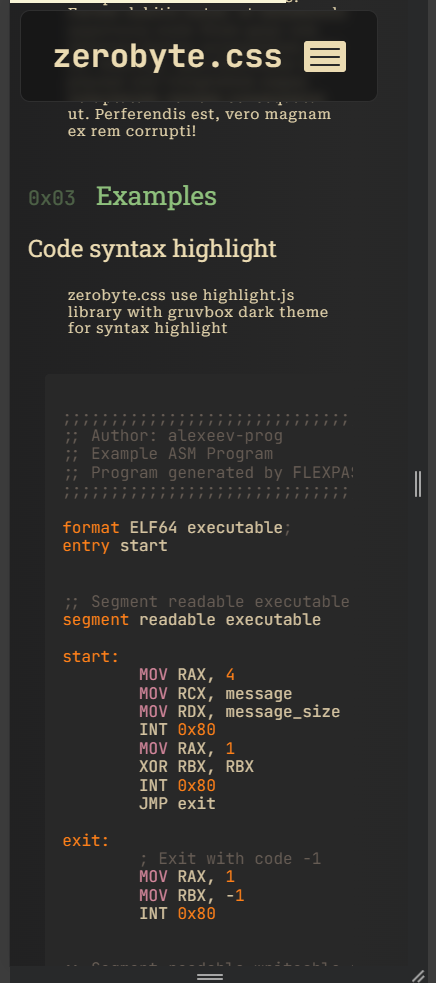

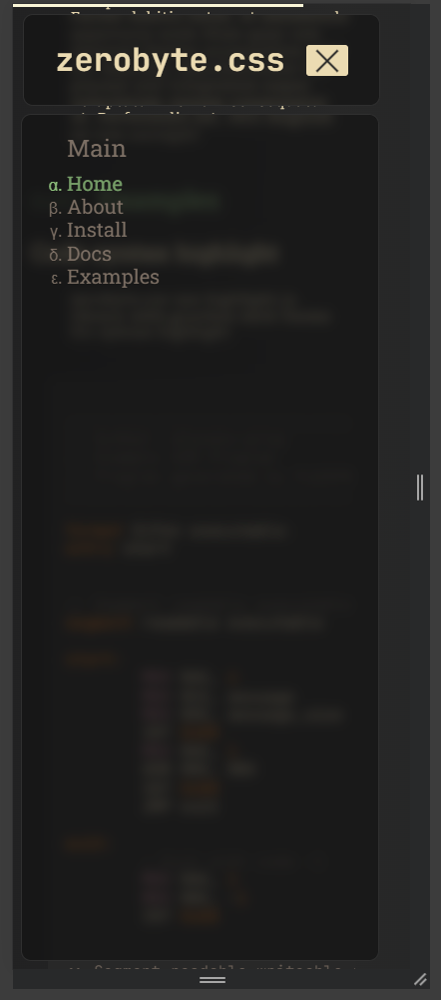

### Catppuccin
```html
<!DOCTYPE html>
<html lang="en" class="catppuccin_colors">
<head>
	<meta charset="UTF-8">
	<meta name="viewport" content="width=device-width, initial-scale=1.0">
	<title>zerobyte.css</title>
	<link rel="preconnect" href="https://fonts.googleapis.com">
	<link rel="preconnect" href="https://fonts.gstatic.com" crossorigin>
	<link href="https://fonts.googleapis.com/css2?family=IBM+Plex+Mono:ital,wght@0,100;0,200;0,300;0,400;0,500;0,600;0,700;1,100;1,200;1,300;1,400;1,500;1,600;1,700&family=JetBrains+Mono:ital,wght@0,100..800;1,100..800&family=Old+Standard+TT:ital,wght@0,400;0,700;1,400&family=Oranienbaum&family=PT+Mono&family=PT+Serif:ital,wght@0,400;0,700;1,400;1,700&display=swap" rel="stylesheet">
	<!-- <link href="https://fonts.googleapis.com/css2?family=Anonymous+Pro:ital,wght@0,400;0,700;1,400;1,700&family=Fira+Code:wght@300..700&family=Ubuntu+Sans+Mono:ital,wght@0,400..700;1,400..700&display=swap" rel="stylesheet"> -->
	<link href="https://fonts.googleapis.com/css2?family=Forum&family=Roboto+Serif:ital,opsz,wght@0,8..144,100..900;1,8..144,100..900&display=swap" rel="stylesheet">
	<link href="https://fonts.googleapis.com/css2?family=Roboto+Slab:wght@100..900&display=swap" rel="stylesheet">

	<link rel="stylesheet" href="css/normalize.css">
	<link rel="stylesheet" href="css/root.css">
	<link rel="stylesheet" href="css/header.css">
	<link rel="stylesheet" href="css/content.css">
	<link rel="stylesheet" href="css/footer.css">
	<link rel="stylesheet" href="css/catppuccin.css">
	<script src="js/highlight.min.js"></script>
</head>
<body>
	<div class="progress" id="scrollIndicator"></div>

	<header id="header" class="header">
		<a href="#"><h1>zerobyte.css</h1></a>

		<nav class="headermenu">
			<a href="#about">About</a>
			<a href="#install">Install</a>
			<a href="#docs">Docs</a>
			<a href="#examples">Examples</a>
		</nav>

		<button class="burger__btn">
			<span></span><span></span><span></span>
		</button>
	</header>
		
	
	<div class="container">
		<div class="introduction">
			<h1 class="title">zerobyte.css</h1>
			<h1 class="subtitle">Dark CSS Library</h1>
			<h1 class="subtitle">for Coders</h1>
			<p class="bottom-text">created by <a href="https://github.com/alexeev-prog">alexeev-prog</a></p>
		</div>

		<div class="sidebar">
			<h3>Main</h3>
			<ul>
				<li class="active"><a href="#" class="active"><h4>Home</h4></a></li>
				<li><a href="#about"><h4>About</h4></a></li>
				<li><a href="#install"><h4>Install</h4></a></li>
				<li><a href="#docs"><h4>Docs</h4></a></li>
				<li><a href="#examples"><h4>Examples</h4></a></li>
			</ul>
		</div>

		<div class="content">
			<div class="contents">
				<h3>Contents</h3>
				<ul>
					<li><a href="#">Home</a></li>
					<li><a href="#about">About</a></li>
					<li><a href="#install">Install</a></li>
					<li><a href="#docs">Docs</a></li>
					<li><a href="#examples">Examples</a></li>
				</ul>
			</div>
			<div id="about">
				<h2 class="section-title">About</h2>
				<p>zerobyte.css is a universal minimalistic fast CSS library for creating minimalistic site for coders (ex. for documentation).</p>
				<p>This library use brighted, high-contrast, smooth, pastel colors and dark theme with combo of mono&serif fonts.</p>
			</div>
			<div id="install">
				<h2 class="section-title">Install</h2>
				<p>Lorem ipsum dolor sit amet consectetur adipisicing elit. Ducimus deserunt aliquid nulla inventore, obcaecati saepe, ipsum quaerat praesentium tempore deleniti excepturi velit optio ut magni quibusdam corporis minima quidem hic!</p>
				<p>Lorem ipsum dolor sit amet consectetur adipisicing elit. Laborum, amet! Numquam ipsam ex, non sequi perspiciatis quos temporibus sapiente voluptatem nihil pariatur animi, eaque aliquam rerum quaerat odit voluptates nisi?
				Quod incidunt, distinctio debitis nesciunt possimus cumque nihil. Culpa, incidunt eaque ea nobis quasi assumenda dicta. Nemo sapiente dignissimos, voluptatum optio quia provident sed odit officiis illo, esse ullam laboriosam.
				Totam dignissimos debitis deserunt vel in optio voluptates, omnis unde distinctio sunt asperiores nulla commodi consequuntur sequi laudantium. Rerum, nostrum! Natus, cumque vel quibusdam fuga aperiam nihil nostrum? Laboriosam, nesciunt?</p>
			</div>
			<div id="docs">
				<h2 class="section-title">Docs</h2>
				<p>Lorem ipsum dolor sit amet consectetur adipisicing elit. Nostrum corrupti soluta sunt facilis natus eligendi odit numquam fugit. Amet consequuntur consectetur omnis nam molestiae, accusantium dolor esse inventore reprehenderit possimus id non eligendi ullam sequi fugit perspiciatis voluptatem vero quaerat autem, exercitationem ducimus ratione voluptatibus veniam officiis? Facere debitis natus, et assumenda asperiores unde illum quae rem deserunt beatae accusantium sunt hic delectus, exercitationem illo placeat nisi voluptatem eaque voluptatum veniam consequatur ut. Perferendis est, vero magnam ex rem corrupti!</p>
			</div>
			<div id="examples">
				<h2 class="section-title">Examples</h2>

				<h3>Code syntax highlight</h3>
				<p>zerobyte.css use highlight.js library with gruvbox dark theme for syntax highlight</p>
				<pre><code class="language-armasm">
;;;;;;;;;;;;;;;;;;;;;;;;;;;;;;;;;;;;;;;;;;;;;;;;;;;;;;;;;;;;;;;;;;;;;;;;;;;;;;;;;;;;;;;;;;;;;;;;;;;;;;;;;;;;;;;;;;;;;;;;
;; Author: alexeev-prog                                                                                               ;;
;; Example ASM Program                                                                                                ;;
;; Program generated by FLEXPASM (github.com/alexeev-pro/flexpasm)                                                    ;;
;;;;;;;;;;;;;;;;;;;;;;;;;;;;;;;;;;;;;;;;;;;;;;;;;;;;;;;;;;;;;;;;;;;;;;;;;;;;;;;;;;;;;;;;;;;;;;;;;;;;;;;;;;;;;;;;;;;;;;;;

format ELF64 executable;                        ; ELF64 EXECUTABLE
entry start                                     ; Set Start Entry


;; Segment readable executable in FASM is a directive for defining a section of code with readable and executable attributes.
segment readable executable

start:                                          ; Label start with 8 commands
	MOV RAX, 4                                      ; Loading 4 value into RAX register.
	MOV RCX, message                                ; Loading message value into RCX register.
	MOV RDX, message_size                           ; Loading message_size value into RDX register.
	INT 0x80                                        ; Call software interrupt 0x80: SYSCALL
	MOV RAX, 1                                      ; Loading 1 value into RAX register.
	XOR RBX, RBX                                    ; Exclusive OR operation RBX and RBX using XOR
	INT 0x80                                        ; Call software interrupt 0x80: SYSCALL
	JMP exit                                        ; Unconditional jump to label exit

exit:                                           ; Label exit with 3 commands
	; Exit with code -1
	MOV RAX, 1                                      ; Loading 1 value into RAX register.
	MOV RBX, -1                                     ; Loading -1 value into RBX register.
	INT 0x80                                        ; Call software interrupt 0x80: SYSCALL


;; Segment readable writeable in FASM is a definition of a segment of program data codes, where the attributes readable (the contents of the segment can be read) and writeable (program commands can both read codes and change their values) are specified for it.
segment readable writeable

message db 'Hello, World!', 0                   ; Var message (string)
message_size = $-message                        ; Var message (string) length
				</code></pre>
				<pre><code class="language-python">
import socket

from typing import Dict


PORTS_SERVICES = {
    20: "FTP-DATA", 21: "FTP", 22: "SSH", 23: "Telnet",
    25: "SMTP", 43: "WHOIS", 53: "DNS", 80: "http",
    115: "SFTP", 123: "NTP", 143: "IMAP", 161: "SNMP",
    179: "BGP", 443: "HTTPS", 445: "MICROSOFT-DS",
    514: "SYSLOG", 515: "PRINTER", 993: "IMAPS",
    995: "POP3S", 1080: "SOCKS", 1194: "OpenVPN",
    1433: "SQL Server", 1723: "PPTP", 3128: "HTTP",
    3268: "LDAP", 3306: "MySQL", 3389: "RDP",
    5432: "PostgreSQL", 5900: "VNC", 8080: "Tomcat", 10000: "Webmin"
}


def is_open_port(target: str, port: int):
    s = socket.socket(socket.AF_INET, socket.SOCK_STREAM)
    s.settimeout(0.5)

    try:
        s.connect((target, port))
        s.close()
    except (socket.gaierror, TimeoutError):
        return port, {
            'status': "Закрыт",
            'comment': PORTS_SERVICES.get(port, 'Неизвестный порт')
        }
    else:
        return port, {
            'status': "Открыт",
            'comment': PORTS_SERVICES.get(port, 'Неизвестный порт')
        }
				</code></pre>
			</div>
		</div>

		<footer>
			<p>powered by <a href="https://github.com/alexeev-prog/zerobyte.css">zerobyte.css</a></p>
		</footer>
	</div>

	<script>hljs.highlightAll();</script>
	<script src="js/script.js"></script>

</body>
</html>
```

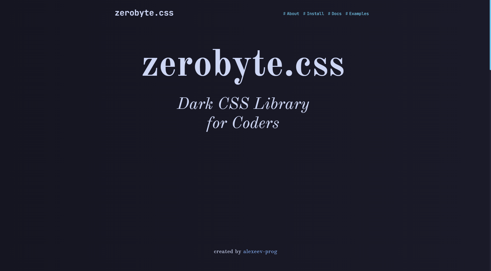

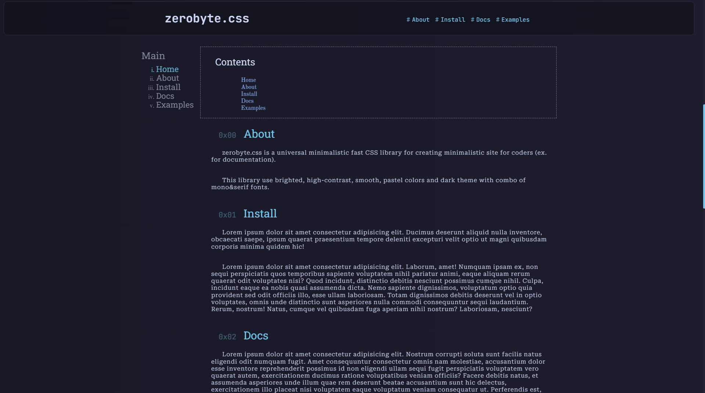

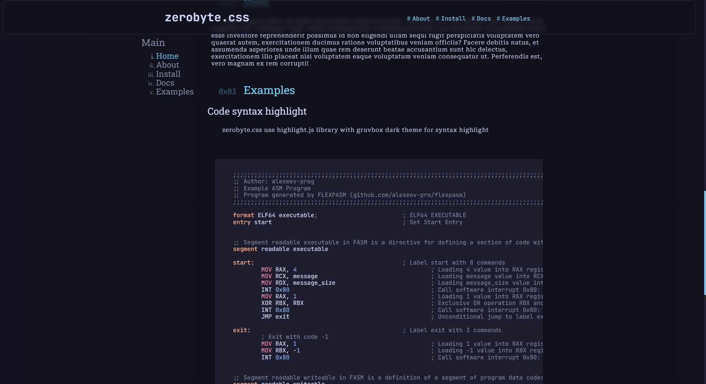

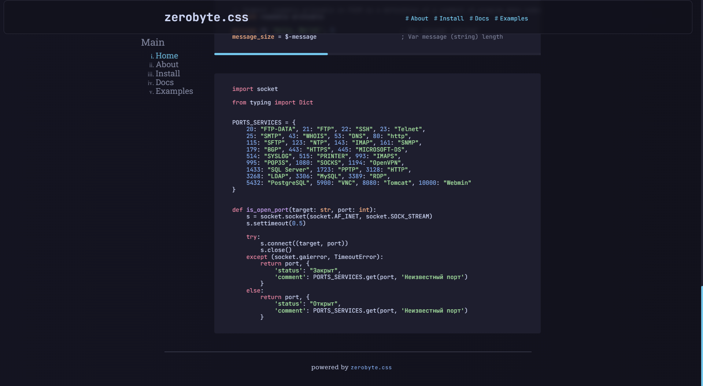

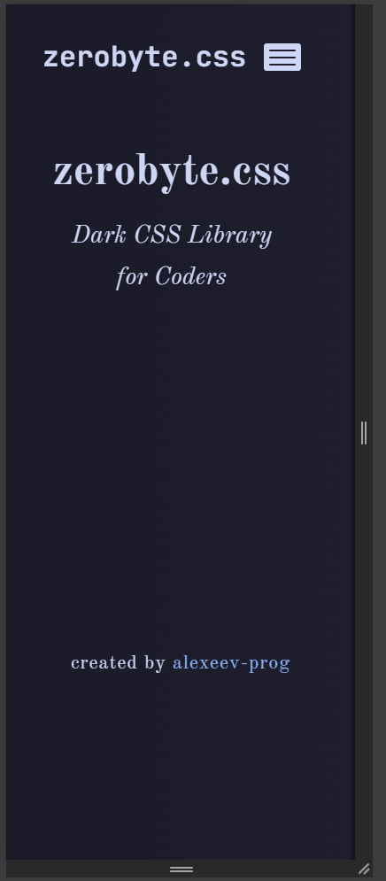

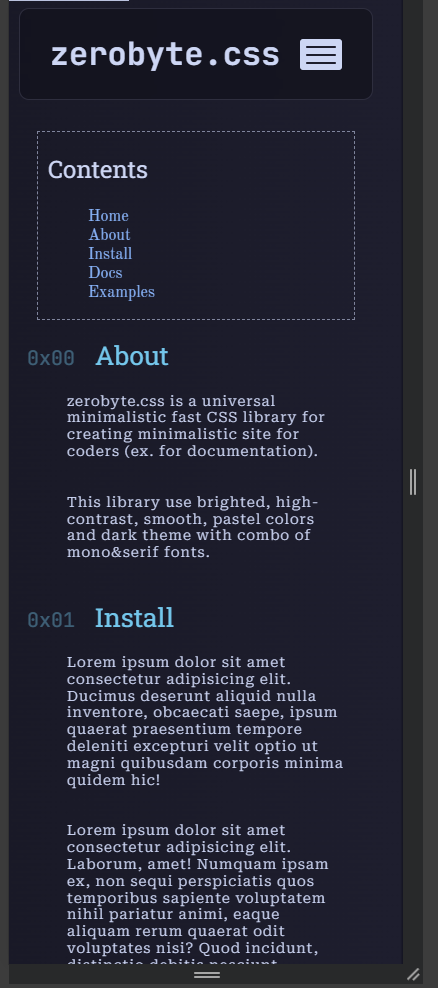

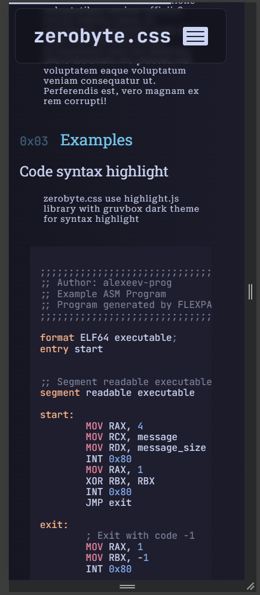

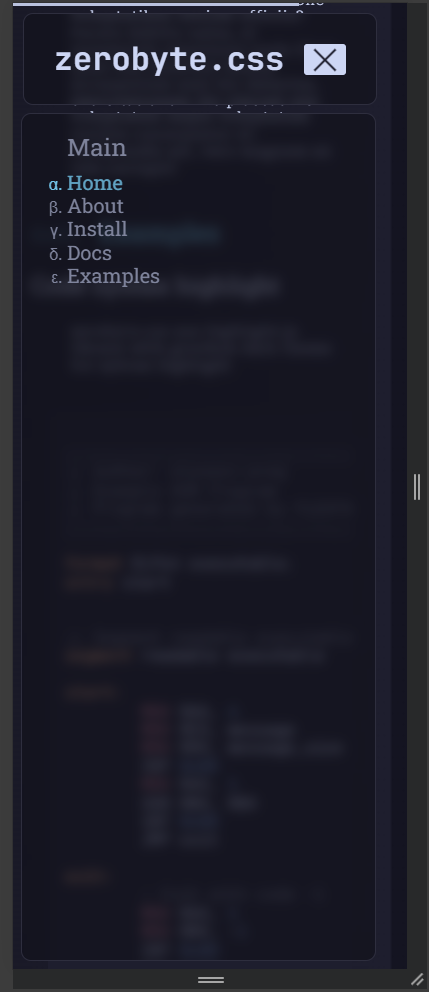
